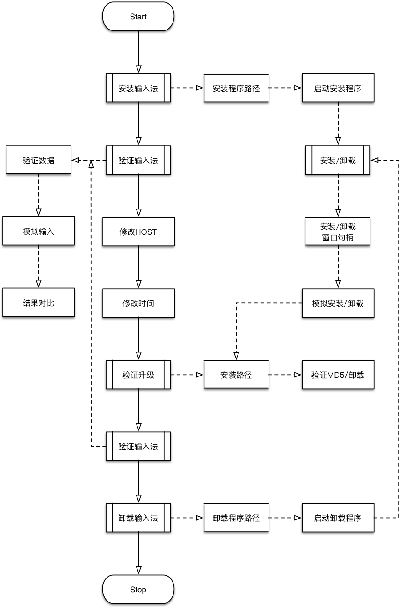

## 1 测试目标

* 整体目标：

    * 测试输入法任意版本，升级到最新版本

* 目标细节：

    1. 安装任意版本输入法，可以完成正常输入；
    2. 调整日期，host，可以完成升级；
    3. 安装升级后文件md5正确;
    4. 开启新进程，可以完成正常输入；

## 2 测试方式

使用python完成以上自动化测试目标，包含以下部分：

1. 使用python自动化安装输入法；
2. 使用python完成自动化输入且验证；
3. 使用python更改系统日期，host，完成自动升级；
4. 使用python验证文件md5；

## 3 测试架构

测试整体流程和架构如下：

初步评估时间需要：8人日。

## 4 测试代码

对主要的逻辑代码，进行测试，保证测试流程的正确性。

具体在完成主要逻辑后进行补充。

## 5 完成测试

每个版本对于升级逻辑（Windows XP，Windows 7，Windows 10三个系统）的测试，可以使用该脚本快速完成。

并且在一定情况下，例如说重复测试升级，可以通过配置开机自动启动节省大量时间。
